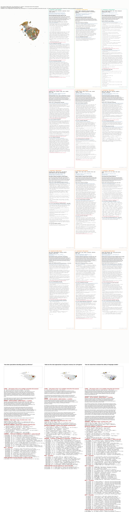

<!-- Spec: .spec/steering/product.md · Task: playbook.md T1 (doc pointer, operator instruction 2026-08-31) -->

# chunkgraph

A dual-space retrieval graph over arbitrary text. Chunks become nodes; edges are
drawn from two independent similarity spaces (sparse BM25 and dense embedding),
normalized, thresholded, fused with provenance, and persisted to Postgres.
Graph construction is fully deterministic — no LLM touches chunking, edge
formation, or community assignment, and every edge names the documents it came
from.

The pipeline and its numbered EARS guards (`R1`…`R21`) live in the module
docstrings of [chunkgraph.py](src/chunkgraph.py) and
[salient_grams.py](src/salient_grams.py); the docstrings ARE the spec for the code
they sit above.

## Repository layout

```
src/            every Python module, flat (modules import each other by bare name; tests and scripts put src/ on the path)
tests/          pytest suite; pytest.ini sets pythonpath = src
docs/           notes and reference: section_map/ (example PNG + markdown), cookbook/ (query snippets), trigram/, psql_graph.md, plan.md, chunking.md
sql/            Postgres init migration, mounted by docker-compose.yml
.spec/          steering and specs (the module docstrings carry the guards)
playbook.md     task ledger
third_party/    ignored: vendored book companion code, re-download from upstream
.tmp/           ignored: every intermediate and output of a run
```

## arXiv section map — start here

The current work is a map over whole **sections** of 2,521 arXiv papers (80,642 usable sections), kept in Postgres
(`chunkgraph-pg`, host port 5433, user/db/password `graph`). Each stage is its own module; run them in this order
from the repo root (`python -u src\<file>.py`). `.tmp/` holds every intermediate and output.

| Step | Entrypoint | What it does |
|---|---|---|
| 1 | `src/section_corpus.py` | cut the extracted papers into sections, keep the usable ones |
| 2 | `src/section_embed.py`, `src/section_sparse.py` | dense (jina v5 nano through model2vec) and sparse (BPE + adjacent pair) vectors |
| 3 | `src/section_map.py` | exact correlation edges in both spaces, one fused graph, Leiden communities, exemplars, UMAP layout |
| 4 | `src/section_store.py --tag xpa` | write the build to Postgres: `sect_node`, `sect_edge`, `sect_community` |
| 4b | `src/section_store.py --tag xpa --entities` | match the frozen entity inventory onto the sections into `sect_mention` (about 6 minutes) |
| 5 | `src/summarize_clusters.py --all` | LLM draft summary per community (resumes from its JSON) |
| 6 | `src/arxiv_titles.py` | paper titles into `paper_title`, prefilled from the CSVs in `C:/Users/user/arxiv_id_lists`, the arXiv API for gaps |
| 7 | `src/section_render.py --tag xpa` | **the picture**: labelled community PNG and markdown (Dunning terms, entities, paper titles) |
| 8 | `src/section_query_panel.py` | ask a question: hybrid retrieval, community view, and the hop-planning ReAct agent, drawn as a strip |

Library modules, imported not run: `section_graphrag.py` (hybrid GraphRAG and the agent), `section_graph.py` (edges),
`arxiv_community_map.py` (exemplars and the card/markdown writers), `term_salience.py` (Dunning terms), `section_genre.py`.
`entity_derive.py` (repo root) derives entities with no tagger: n-grams filtered by NPMI, closed-class, nesting and residual-IDF rules.

Three layers stay apart. **Vector edges** join section to section (`sect_edge`; communities come from these).
**Mentions** join a section to an entity (`sect_mention`). **Co-mention edges** join entity to entity
(`sect_entity_edge`, `kind = 'co_mention'`, NPMI > 0 over at least 5 shared sections). Co-mention edges feed no
retrieval step yet. The agent's answer quality is not yet measured against plain retrieval.

### What the map looks like

One card per community, largest first, with its Dunning terms, its top entities, its exemplar sections and the
paper each came from. [`docs/section_map/community_map.png`](docs/section_map/community_map.png) is the
picture, with the three example questions drawn as a strip under the cards (hops taken, subgraph size, entity composition per query); [`docs/section_map/communities.md`](docs/section_map/communities.md) is the same content as text
(every exemplar section, with links to arXiv). Both are copies of what `src/section_render.py` writes to `.tmp/`.



### How edges are decided (section to section)

Two representations of every section, compared **exactly**, all pairs, no approximate index:

| Space | Vector | Reads as |
|---|---|---|
| dense | jina-embeddings-v5-text-nano through model2vec (256 dims), centred on the corpus mean | meaning |
| sparse | BPE pieces plus adjacent pairs, unit rows | shared wording (this is where terms enter the edges) |

1. For each space, the cosine of every pair is turned into a z-score against a Box-Cox-normalised null of all pairs.
2. A pair is an edge in that space when **z >= 2.0 and it is in the node's exact top 15**.
3. Every node also keeps its top 2 neighbours per space (the backbone), at a tiny floor weight, so none is isolated.
4. The two spaces fuse by union; the edge weight is the mean z over the spaces that saw the pair (clipped at 0) plus the floor.
5. Leiden runs over the fused matrix: a resolution sweep, a plateau pick, three-run consensus, and a seed-stability gate (ARI >= 0.8).
   Communities of one section are dropped and left as unassigned nodes.

Terms never make an edge on their own. The Dunning terms on each card are **labels**: for each community, the words and
word pairs whose share inside it is most over-represented against the whole corpus (Dunning log-likelihood G2).

### How entities and entity edges are decided

Entities are derived from the text by information theory, with no tagger, no NER and no pretrained model
(`entity_derive.py`, guards AE1 to AE15):

1. Candidates are n-grams of up to 4 tokens inside one sentence, never across math, a citation or a table cell.
2. A candidate must occur in enough **papers** (not chunks), so one broken book cannot create entities.
3. It scores zero, and is dropped, if its weakest split has NPMI <= 0; if it starts or ends with a closed-class word
   (derived from the corpus, no stop list); if a longer gram accounts for most of its occurrences; if its residual IDF is
   low (spread evenly, so vocabulary rather than an entity); or if every token is a single character (math left outside `$...$`).
4. Acronym and expansion pairs (`LLM`, `large language model`) are merged into one entity.
5. The survivors form a frozen inventory of about 40,000 entities, built on the chunk map and matched, longest first with no
   overlap, onto the section bodies. That is `sect_mention` (section to entity, with a count).

Entity edges (`sect_entity_edge`, `kind = 'co_mention'`) join two entities that occur together in at least 5 sections, both
in at most 2,000 sections, kept only when NPMI = ln(p_ab / (p_a p_b)) / -ln(p_ab) is positive. The `kind` column keeps this
evidence apart from vector edges: entities are never nodes of `sect_edge`, and an entity vector is never an edge.
`rel:<class>` (DIRT-style relation edges) is reserved and not built.

Entities per community on a card are chosen by Dunning G2 against the corpus; the entities shown for a question's subgraph
are ranked by sections x ln(N / df), with hubs over 2,000 sections out and subset or superset names merged.

`louvain_pg.py` and `psql_graph.md` are the reference for running Louvain over a Postgres property graph; the section
map follows their idea (graph and communities in Postgres) but uses Leiden over `sect_edge`.

## Where things are documented

| Topic | Where |
|---|---|
| Product intent, pipeline stage table | [.spec/steering/product.md](.spec/steering/product.md) |
| Repo layout, conventions, architectural decisions | [.spec/steering/structure.md](.spec/steering/structure.md) |
| End-to-end pipeline (ingest → query → analyze → interpret) | [.spec/PIPELINE.md](.spec/PIPELINE.md) |
| Cross-cutting design and rationale | [.spec/specs/graph-explorer/design.md](.spec/specs/graph-explorer/design.md) |
| **Multi-source ingest** (Brown + quotes + wikitext in one graph): per-source chunk fits (R19), source metadata (R20), per-source-pair block normalization with one global cut (R21), and the distribution-alignment rationale — why per-block Box-Cox-to-z handles register *and* size imbalance with no quotas | [design.md §6.14](.spec/specs/graph-explorer/design.md), "Multi-source ingest" |

## Quickstart — ask the corpus a question

Windows (`cmd`, the primary shell here). **`PYTHONPATH=src python ...` is bash-only
and fails in cmd with `ModuleNotFoundError: No module named 'config'`** — `set` it
on its own line instead:

```bat
docker compose up -d graphdb
set PYTHONPATH=src
set OPENROUTER_API_KEY=...
python -m streamlit run src/walker_app.py --server.port 8501
```

PowerShell uses `$env:` and bash uses the inline form:

```powershell
$env:PYTHONPATH="src"; $env:OPENROUTER_API_KEY="..."
python -m streamlit run src/walker_app.py --server.port 8501
```

```bash
PYTHONPATH=src OPENROUTER_API_KEY=... python -m streamlit run src/walker_app.py --server.port 8501
```

Open <http://localhost:8501>, pick a run in the dropdown, type a question.

`config.MODEL_DIR` must point at a model2vec artifact for the dense space (R14);
without it the system still runs sparse-only (R5).

**Two things that will otherwise look like bugs:**

- **The walker caches by (run, prompt).** Asking the same question twice replays
  the first answer rather than re-walking. Restart streamlit to clear it, or
  change the wording. (This produced a stale screenshot during T96 and cost an
  hour of misdiagnosis.)
- **Answers are not deterministic.** The agentic loop calls a model, so the same
  question can land differently run to run. Measured on `ab-section`, "who is the
  most famous musician of the 1990's?": the right artist is named in **3 of 4**
  runs; the fourth returns no answer (`entailed=0`). A blank answer is the known
  failure mode, not a regression — ask again. Everything BEFORE the model call is
  deterministic and reruns identically.

## Checking it works

With `PYTHONPATH` already set (see above):

```bat
REM deterministic: does the gold term survive into the evidence the judge reads?
REM no model call, zero variance, rerunning gives the same number (6.29)
python src\diag_evidence.py ab-section

REM the frozen 20-row do-no-harm gate
REM expect: PASS 18/20 | FAIL ['E3'] | KNOWN-FAIL ['A2']
python src\diag_rerun.py mixed-full-dual

REM the 9-row gold lane: runs the full agentic loop and scores the ANSWER.
REM carries the model's sampling variance -- read 6.29 before comparing two
REM configurations with it; its repeat noise (0.139) exceeds the effects it is
REM usually pointed at (0.083)
python src\diag_agentic.py ab-section
```

## Ingest

`CHUNKGRAPH_MODEL_DIR` is needed for ingest only (it turns the dense space on):

```bat
for /f %i in ('python -c "import config;print(config.MODEL_DIR)"') do set CHUNKGRAPH_MODEL_DIR=%i
python src/ingest_brown.py <label>
python src/ingest_mixed.py <label> --brown N --quotes N --wiki N
python src/ingest_mixed.py <label> --chunk-mode section
pytest -q
```

`--chunk-mode section` fits chunk size on paragraph counts per heading-delimited
section, per source (R23); `document` is the older whole-document rule (R17/R19)
and remains the default so existing runs stay reproducible. Changing the
tokenizer or the chunk mode requires a re-ingest — the index stores the tokens.
